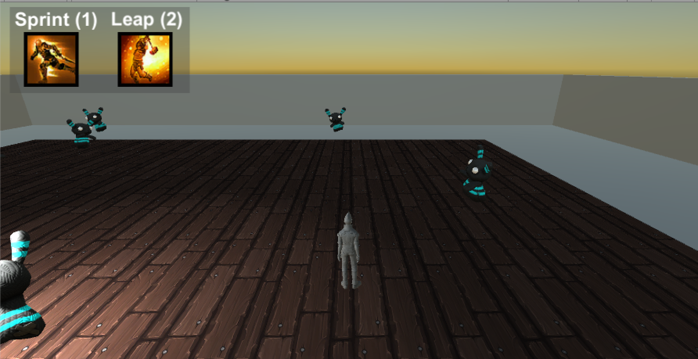
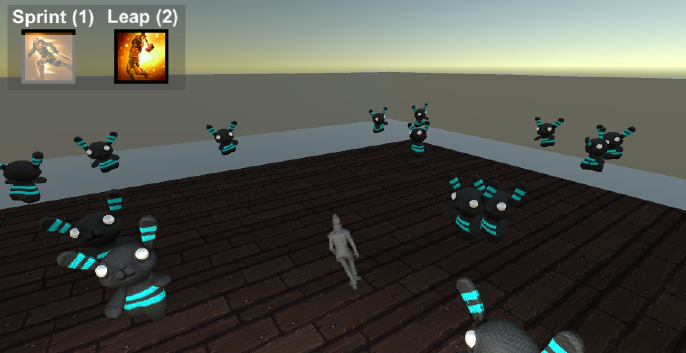

# DodgeThis

Currently under development.

Inspired by Dodge This Shit from Warcraft 3, when games were actually made for fun and not for DLCs and money.

## Gameplay

### Movement
W - Move forward

A - Rotate camera, turn player left

D - Rotate camera, turn player right

S - At the moment, buggy and cannot be used (known Unity bug with attaching main camera to third person character)

Space - Jump (default jump is pretty useless, however).

### Skills
Skills are activated with numeric keys.

1 - Sprint, player is able to increase movement speed, cooldown 5 seconds, lasts for 1 second.

2 - Leap, player leaps, increasing jump power from default 6, to 12. Buff which lasts 5 seconds, and cooldown is 5 seconds (obviously not "balanced" and will need to fix).

## Screenshots

  
  

## To fix
* Fix S movement
* Fix Leap skill, so it triggers on press

## Extensions
In order of priority extensions which I may implement
* Different levels
* Score system
* Multiplayer
* Better graphics 

## Acknowledgements
Skill sprites - Guild Wars 1

AI models -  Unity Standard Assets, Survival Shooter Tutorial.

Player model - Unity Standard Assets.
